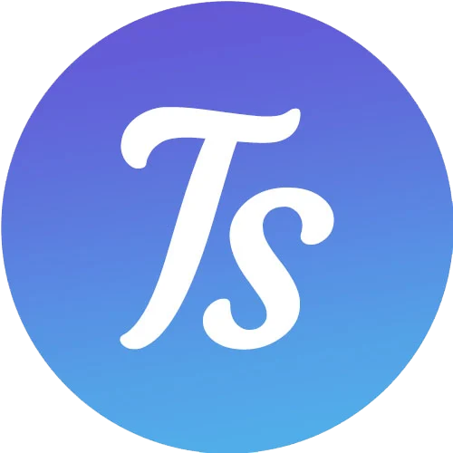

### Hi there 👋
I have done projects using HTML, CSS, JS, PHP, WordPress, Node.JS, MongoDB, Python, AI algorithm, MySQL, C#, SQLServer, VC++, OpenGL, API, VB, Oracle DB, and Oracle UI. But I have used early to upload my projects to several servers/hosts, e.g., Gitlab, Gitlab Tu Berlin,  Github, and others. You will not find projects right now showing my basic skills. But I am going to upload them day by day...
<table border=0>                                      
  <tr border=0>                                                                                                 
    <td border=0>               
<h5> welcome to you 😀, feel free to contact me at:</h5> 
	  
   
     	      
                                            
                         
<h2 font-color='red'>Skills : </h2>
  

  

            
                                            
         

    

	     
   

<!-- -->
    
 
    
 
    
    

    </td> 
     <td border=0>
      
      </td>
    </tr>           
            
  
<table style="width:100%"> 
  <tr>
    <th align="center">
	    

</th> 
  </tr>
</table>
<h1>My Youtube channel<a href="https://www.youtube.com/c/TippsausEuropa">@Tips from Europe</a> 
<h3>Most of the Hollywood Stars start to practice the following activity since years</h3><h1>Therapeutic Fasting</h1>
<h3>Heilfasten,Therapeutic Fasting - Otto Buchinger #Heilfasten #Fasting</h3>

## Next planned Projects to upload
<table>
<td>  
<ol>
<li> Framework of exporting Coloab  Py and Latex to PDF with refernces</li>
<li> QU LAB AI Algorithm supervised Learning using Py</li>
<li> OpenGL and VC++ app</li>
<li> Learn App with TTS Engine using Android Studio and Java</li>
<li> Car agency Management System using Oracle UI and DB</li>
<li> Red Cross and red Crescent Management System App using c# and SQL server</li>
<li> Ebdaa-Co website using PHP, HTML, CSS and JS </li>
</ol>
</td> 
</table>
## On Progress Thesis, Projects, Apps
<table>
<td> 
<ol>
<li><a href="https://github.com/MohamedMesto/MasterThesis-QU-DFKI-comparison-in-between-Emformer">MasterThesis-QU-DFKI-Accented-Speech-Recognition-ASR: </a>Master Thesis - Accented Speech Recognition by Institut für Softwaretechnik und Theoretische Informatik
Quality and Usability Lab <b>QU</b> and Deutsches Forschungszentrum für Künstliche Intelligenz <b>DFKI</b></li>
 <li><a href="https://github.com/MohamedMesto/ASR-Accent-Analysis-De">ASR-Accent-Analysis-De: </a>Accented Speech Recognition Analysis- German Accents</li>
<li>Translate Web site - Abix Package from De to Tr using PHP, HTML, CSS and JS</li>
</ol>
</td>	 
</table>

## Thesis, Projects and Seminars:
<table>
<td>
<ol>
<li><a href="https://github.com/MohamedMesto/MasterThesis-Comparative-Analysis-of-OS-5G-Core-Implementations-Design-and-Evaluation-of-5G-Testbed">MasterThesis-Comparative-Analysis-of-OS-5G-Core-Implementations-Design-and-Evaluation-of-5G-Testbed</a> : " Comparative Analysis of Open Source 5G Core Implementations and Design and Evaluation of a 5G Testbed for Industrial Communication Master’s Thesis shortened Draft"</li>

<li><a href="https://github.com/MohamedMesto/MasterThesis-QU-DFKI-Accented-Speech-Recognition-ASR"> MasterThesis-QU-DFKI-Accented-Speech-Recognition-AccSR</a>: "Master Thesis in Accented Speech Recognition AccSR"</li>
<li><a href="https://github.com/MohamedMesto/AWT-PJ-ss22-Video-Streaming-Mixer-Library-1">
AWT-PJ-ss22-Video-Streaming-Mixer-Library-1</a> : Video Streaming Mixer Library</li>
<li><a href="https://github.com/MohamedMesto/AdvancedWebTech-Synchronization-of-Web-Application-with-Broadcast-TV">AdvancedWebTech-Synchronization-of-Web-Application-with-Broadcast-TV</a> : "Synchronization of Web Application with Broadcast TV"</li>
<li><a href="https://github.com/MohamedMesto/Visualization-In-Digital-Occupation-Latex-Atlas.ti">Visualization-In-Digital-Occupation-Latex-Atlas.ti</a>: "Visualization In Digital Occupation-Stereotype-free representation of “IT Security Administrator""</li>
<li><a href="https://github.com/MohamedMesto/Service-Based-Architecture-Study">Service-Based-Architecture-Study</a>: "Service Based Architecture Study Seminar"</li>
<li><a href="https://github.com/MohamedMesto/Co_existence_of_WiFi_at_5_GHz">Co_existence_of_WiFi_at_5_GHz</a>: "Co existence of WiFi at 5 GHz Seminar"</li>		
<li><a href="https://github.com/MohamedMesto/QualityandUsabilitySeminarStatistics-in-HCI-QU-SEM">QualityandUsabilitySeminarStatistics-in-HCI-QU-SEM</a>: "Quality and Usability Seminar Statistics-in-HCI-QU-SEM"</li>	
<li><a href="https://github.com/MohamedMesto/Statistical-Analysis-and-Engineering-Acoustics-Py"> Statistical-Analysis-and-Engineering-Acoustics-Py</a>: "Statistical Analysis and Engineering Acoustics"</li>
<li><a href="https://github.com/MohamedMesto/CrossWord-Schneiderlein-De">CrossWord-Schneiderlein-De </a>: "Tailor Crossword in German "</li>
<li> ... upload soon</li>
</ol>

</td>
</table>
Thanks for checking out my profile.
